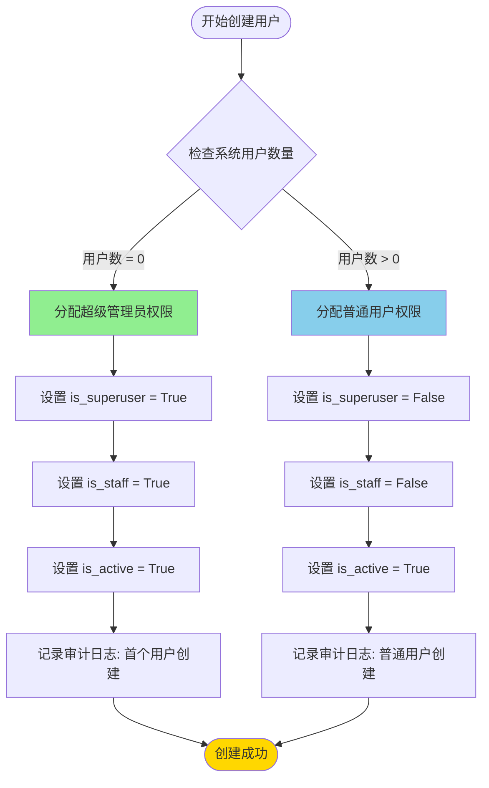
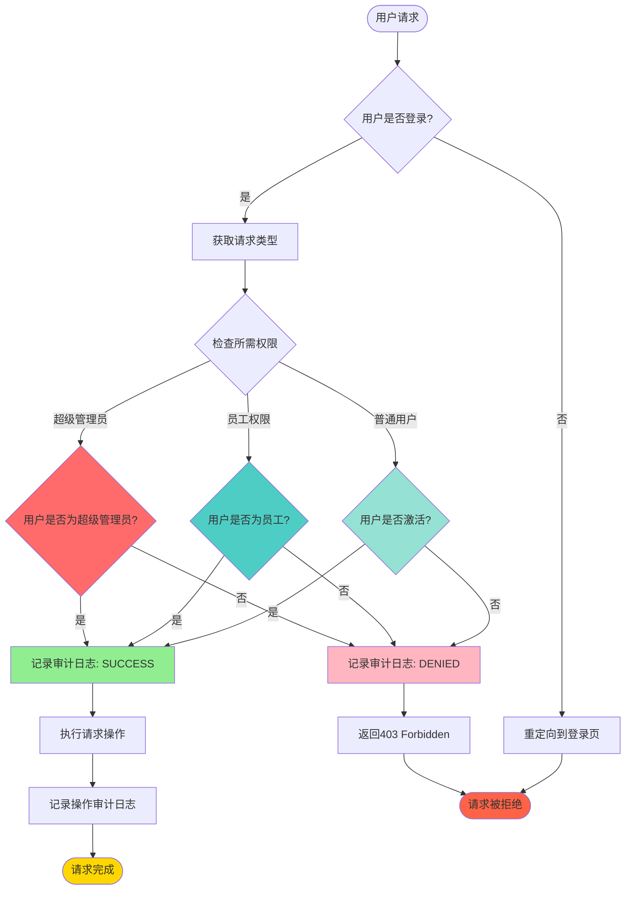
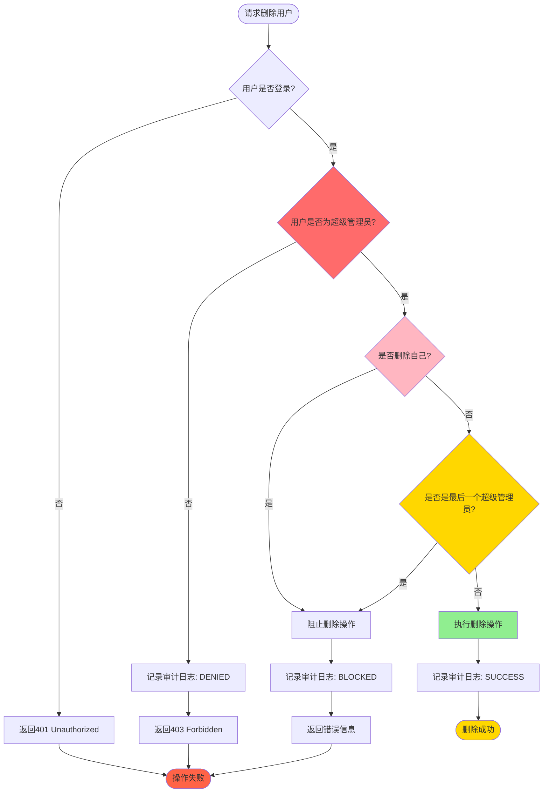
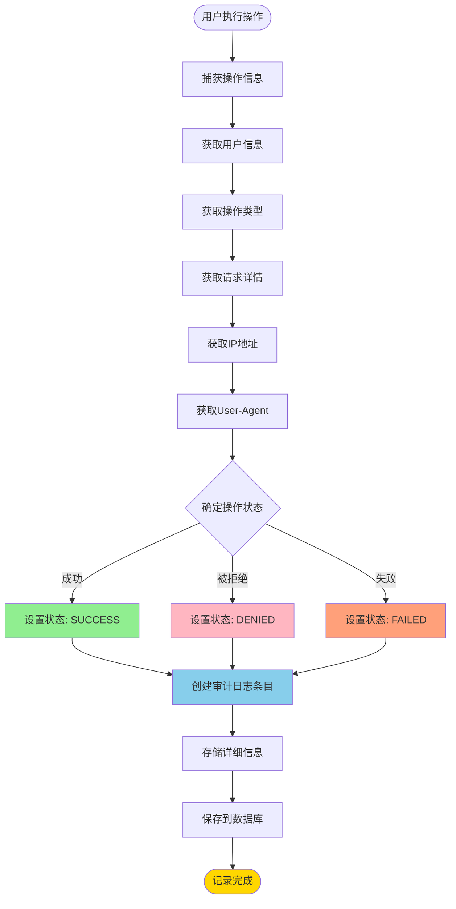

# 用户权限控制系统文档

## 目录
1. [系统概述](#系统概述)
2. [权限分配流程图](#权限分配流程图)
3. [权限验证伪代码](#权限验证伪代码)
4. [系统架构](#系统架构)
5. [安全机制](#安全机制)
6. [使用指南](#使用指南)

---

## 系统概述

本权限控制系统确保系统中仅第一个注册或创建的用户拥有超级管理员权限，后续所有用户默认为普通用户。系统包含以下核心功能：

- **角色权限体系**：区分超级管理员和普通用户的权限边界
- **自动权限分配**：首个用户自动获得超级管理员权限
- **权限验证中间件**：在关键操作前验证用户权限级别
- **审计日志系统**：记录所有权限相关操作
- **安全防护机制**：防止自删除、自禁用等危险操作

### 权限级别定义

| 权限级别 | is_superuser | is_staff | is_active | 权限范围 |
|---------|-------------|----------|-----------|---------|
| 超级管理员 | True | True | True | 所有操作权限 |
| 普通用户 | False | False | True | 基础访问权限 |
| 已禁用用户 | False | False | False | 无权限 |

---

## 权限分配流程图

### 1. 用户创建权限分配流程



### 2. 权限验证流程



### 3. 用户删除权限验证流程



### 4. 审计日志记录流程



---

## 权限验证伪代码

### 1. 首个用户检测函数

```python
def is_first_user():
    """
    检查当前是否是系统中的第一个用户
    
    Returns:
        bool: 如果是第一个用户返回True，否则返回False
    """
    user_count = User.objects.count()
    return user_count == 0
```

### 2. 超级管理员权限验证装饰器

```python
def super_admin_required(view_func):
    """
    超级管理员权限验证装饰器
    
    验证用户是否为超级管理员，如果不是则拒绝访问并记录审计日志
    """
    def wrapper(request, *args, **kwargs):
        # 步骤1: 检查用户是否登录
        if not request.user.is_authenticated:
            log_permission_audit(
                user=request.user,
                action='ACCESS_ADMIN',
                status='DENIED',
                request=request,
                details={'reason': '未登录'}
            )
            return redirect_to_login(request.get_full_path())
        
        # 步骤2: 检查用户是否为超级管理员
        if not request.user.is_superuser:
            log_permission_audit(
                user=request.user,
                action='ACCESS_ADMIN',
                status='DENIED',
                request=request,
                details={
                    'reason': '权限不足',
                    'required_permission': 'superuser',
                    'user_permission': 'normal'
                }
            )
            return HttpResponseForbidden('需要超级管理员权限')
        
        # 步骤3: 记录成功访问
        log_permission_audit(
            user=request.user,
            action='ACCESS_ADMIN',
            status='SUCCESS',
            request=request
        )
        
        # 步骤4: 执行原视图函数
        return view_func(request, *args, **kwargs)
    
    return wrapper
```

### 3. 用户创建权限控制逻辑

```python
def create_user_with_permission_control(request):
    """
    创建用户并自动分配权限
    
    逻辑流程:
    1. 检查用户是否登录
    2. 检查用户是否为超级管理员
    3. 检查是否是第一个用户
    4. 根据条件分配权限
    5. 记录审计日志
    """
    # 步骤1: 验证用户权限
    if not request.user.is_authenticated:
        return redirect_to_login(request.get_full_path())
    
    if not request.user.is_superuser and not is_first_user():
        log_permission_audit(
            user=request.user,
            action='CREATE_USER',
            status='DENIED',
            request=request,
            details={'reason': '权限不足'}
        )
        return HttpResponseForbidden('需要超级管理员权限')
    
    # 步骤2: 获取表单数据
    username = request.POST.get('username')
    password = request.POST.get('password1')
    
    # 步骤3: 检查是否是第一个用户
    first_user = is_first_user()
    
    # 步骤4: 创建用户并分配权限
    if first_user:
        # 第一个用户自动获得超级管理员权限
        user = User.objects.create_user(
            username=username,
            password=password,
            is_superuser=True,  # 自动设置为超级管理员
            is_staff=True,      # 自动设置为员工
            is_active=True      # 自动激活
        )
        
        log_permission_audit(
            user=user,
            action='CREATE_USER',
            status='SUCCESS',
            request=request,
            details={
                'username': username,
                'is_first_user': True,
                'assigned_role': 'super_admin'
            }
        )
    else:
        # 后续用户为普通用户
        user = User.objects.create_user(
            username=username,
            password=password,
            is_superuser=False,  # 普通用户
            is_staff=False,      # 非员工
            is_active=True       # 自动激活
        )
        
        log_permission_audit(
            user=request.user,
            action='CREATE_USER',
            status='SUCCESS',
            request=request,
            details={
                'username': username,
                'is_first_user': False,
                'assigned_role': 'normal_user'
            }
        )
    
    return redirect('user_list')
```

### 4. 用户删除权限控制逻辑

```python
def delete_user_with_permission_control(request, user_id):
    """
    删除用户并验证权限
    
    安全检查:
    1. 用户必须为超级管理员
    2. 不能删除自己
    3. 不能删除最后一个超级管理员
    """
    # 步骤1: 验证用户权限
    if not request.user.is_authenticated:
        return redirect_to_login(request.get_full_path())
    
    if not request.user.is_superuser:
        log_permission_audit(
            user=request.user,
            action='DELETE_USER',
            status='DENIED',
            request=request,
            details={'reason': '权限不足'}
        )
        return HttpResponseForbidden('需要超级管理员权限')
    
    # 步骤2: 获取目标用户
    target_user = get_object_or_404(User, id=user_id)
    
    # 步骤3: 安全检查 - 不能删除自己
    if target_user.id == request.user.id:
        log_permission_audit(
            user=request.user,
            action='DELETE_USER',
            status='BLOCKED',
            request=request,
            details={'reason': '尝试删除自己'}
        )
        return JsonResponse({'success': False, 'error': '不能删除自己'})
    
    # 步骤4: 安全检查 - 不能删除最后一个超级管理员
    if target_user.is_superuser:
        super_admin_count = User.objects.filter(is_superuser=True).count()
        if super_admin_count <= 1:
            log_permission_audit(
                user=request.user,
                action='DELETE_USER',
                status='BLOCKED',
                request=request,
                details={'reason': '不能删除最后一个超级管理员'}
            )
            return JsonResponse({'success': False, 'error': '不能删除最后一个超级管理员'})
    
    # 步骤5: 执行删除
    username = target_user.username
    target_user.delete()
    
    # 步骤6: 记录审计日志
    log_permission_audit(
        user=request.user,
        action='DELETE_USER',
        status='SUCCESS',
        request=request,
        details={
            'deleted_username': username,
            'deleted_user_id': user_id
        }
    )
    
    return JsonResponse({'success': True})
```

### 5. 权限审计中间件伪代码

```python
class PermissionAuditMiddleware:
    """
    权限审计中间件
    
    功能:
    1. 记录所有权限相关的请求
    2. 捕获用户信息、IP地址、请求详情
    3. 记录操作结果（成功/失败/被拒绝）
    """
    
    def __init__(self, get_response):
        self.get_response = get_response
    
    def __call__(self, request):
        # 步骤1: 检查是否需要审计
        if not self.should_audit(request):
            return self.get_response(request)
        
        # 步骤2: 捕获请求信息
        request_info = self.capture_request_info(request)
        
        # 步骤3: 执行请求
        response = self.get_response(request)
        
        # 步骤4: 确定操作状态
        status = self.determine_status(response)
        
        # 步骤5: 记录审计日志
        if request.user.is_authenticated:
            log_permission_audit(
                user=request.user,
                action=request_info['action'],
                status=status,
                request=request,
                details=request_info['details']
            )
        
        return response
    
    def should_audit(self, request):
        """
        判断是否需要审计该请求
        
        需要审计的路径:
        - /admins/
        - /user-form/
        - /delete-user/
        """
        audit_paths = ['/admins/', '/user-form/', '/delete-user/']
        return any(request.path.startswith(path) for path in audit_paths)
    
    def capture_request_info(self, request):
        """捕获请求信息"""
        return {
            'action': self.get_action_type(request),
            'details': {
                'method': request.method,
                'path': request.path,
                'params': dict(request.POST or request.GET)
            }
        }
    
    def get_action_type(self, request):
        """根据请求路径确定操作类型"""
        if '/user-form/' in request.path:
            return 'CREATE_USER' if request.method == 'POST' else 'ACCESS_USER_FORM'
        elif '/delete-user/' in request.path:
            return 'DELETE_USER'
        elif '/admins/' in request.path:
            return 'ACCESS_ADMIN'
        return 'UNKNOWN'
    
    def determine_status(self, response):
        """根据响应确定操作状态"""
        if response.status_code == 200:
            return 'SUCCESS'
        elif response.status_code == 403:
            return 'DENIED'
        else:
            return 'FAILED'
```

### 6. 权限检查辅助函数

```python
def is_super_admin(user):
    """
    检查用户是否为超级管理员
    
    Args:
        user: 用户对象
        
    Returns:
        bool: 如果是超级管理员返回True，否则返回False
    """
    if not user or not user.is_authenticated:
        return False
    return user.is_superuser

def is_staff_member(user):
    """
    检查用户是否为员工
    
    Args:
        user: 用户对象
        
    Returns:
        bool: 如果是员工返回True，否则返回False
    """
    if not user or not user.is_authenticated:
        return False
    return user.is_staff

def can_manage_users(user):
    """
    检查用户是否可以管理其他用户
    
    Args:
        user: 用户对象
        
    Returns:
        bool: 如果可以管理用户返回True，否则返回False
    """
    return is_super_admin(user)

def can_delete_user(operator, target_user):
    """
    检查操作者是否可以删除目标用户
    
    Args:
        operator: 操作者用户对象
        target_user: 目标用户对象
        
    Returns:
        bool: 如果可以删除返回True，否则返回False
    """
    # 不能删除自己
    if operator.id == target_user.id:
        return False
    
    # 必须是超级管理员
    if not is_super_admin(operator):
        return False
    
    # 不能删除最后一个超级管理员
    if target_user.is_superuser:
        super_admin_count = User.objects.filter(is_superuser=True).count()
        if super_admin_count <= 1:
            return False
    
    return True
```

---

## 系统架构

### 核心组件

```
┌─────────────────────────────────────────────────────────────┐
│                     Django 应用层                            │
├─────────────────────────────────────────────────────────────┤
│  views.py (视图层)                                           │
│  ├── user_form()          - 用户创建/编辑                    │
│  ├── delete_user()        - 用户删除                        │
│  └── admins()             - 管理页面                        │
├─────────────────────────────────────────────────────────────┤
│  permissions.py (权限层)                                     │
│  ├── super_admin_required  - 超级管理员装饰器                │
│  ├── staff_required       - 员工装饰器                       │
│  ├── PermissionAuditMiddleware - 权限审计中间件             │
│  ├── is_first_user()      - 首个用户检测                     │
│  ├── is_super_admin()     - 超级管理员检测                   │
│  └── log_permission_audit() - 审计日志记录                  │
├─────────────────────────────────────────────────────────────┤
│  models.py (数据模型层)                                      │
│  ├── PermissionAuditLog  - 权限审计日志模型                 │
│  └── SystemConfig         - 系统配置模型                     │
├─────────────────────────────────────────────────────────────┤
│  admin.py (管理后台)                                         │
│  ├── PermissionAuditLogAdmin - 审计日志管理                 │
│  └── SystemConfigAdmin      - 系统配置管理                   │
└─────────────────────────────────────────────────────────────┘
```

### 数据流程

```
用户请求
    ↓
[权限审计中间件] - 记录请求信息
    ↓
[权限验证装饰器] - 验证用户权限
    ↓
[视图函数] - 执行业务逻辑
    ↓
[权限检查] - 验证操作合法性
    ↓
[审计日志记录] - 记录操作结果
    ↓
返回响应
```

---

## 安全机制

### 1. 权限隔离

- **超级管理员**：拥有所有权限，可以创建、编辑、删除用户
- **普通用户**：仅拥有基础访问权限，无法管理其他用户
- **权限验证**：所有敏感操作都经过严格的权限检查

### 2. 防护机制

| 防护类型 | 实现方式 | 保护对象 |
|---------|---------|---------|
| 防自删除 | 检查操作者ID与目标用户ID | 防止用户删除自己 |
| 防自禁用 | 检查操作者ID与目标用户ID | 防止用户禁用自己 |
| 防最后管理员删除 | 统计超级管理员数量 | 防止删除最后一个超级管理员 |
| 防权限提升 | 严格控制权限分配 | 防止普通用户获得管理员权限 |

### 3. 审计追踪

- **操作记录**：记录所有权限相关操作
- **详细信息**：包括操作类型、操作用户、IP地址、时间戳
- **状态追踪**：记录操作状态（成功/失败/被拒绝）
- **可追溯性**：所有操作都可追溯到具体用户和时间

---

## 使用指南

### 1. 首次部署

```bash
# 1. 创建数据库迁移
python manage.py makemigrations mdsource

# 2. 执行数据库迁移
python manage.py migrate

# 3. 创建超级管理员（第一个用户）
python manage.py createsuperuser
# 输入用户名和密码后，系统会自动分配超级管理员权限
```

### 2. 创建新用户

**方式1：通过管理界面**
1. 使用超级管理员账号登录
2. 访问 `/user-form/` 页面
3. 填写用户信息并提交
4. 系统会自动分配普通用户权限

**方式2：通过Django管理后台**
1. 访问 `/admin/` 页面
2. 进入Users管理
3. 添加新用户
4. 设置权限（注意：不要随意分配超级管理员权限）

### 3. 查看审计日志

**方式1：通过Django管理后台**
1. 访问 `/admin/` 页面
2. 进入Permission Audit Logs管理
3. 查看所有权限操作记录

**方式2：通过代码查询**
```python
from mdsource.models import PermissionAuditLog

# 查询所有审计日志
logs = PermissionAuditLog.objects.all()

# 查询特定用户的操作
user_logs = PermissionAuditLog.objects.filter(user=user)

# 查询被拒绝的操作
denied_logs = PermissionAuditLog.objects.filter(status='DENIED')

# 查询特定类型的操作
create_logs = PermissionAuditLog.objects.filter(action='CREATE_USER')
```

### 4. 运行测试

```bash
# 运行所有权限测试
python manage.py test mdsource.tests_permissions

# 运行特定测试类
python manage.py test mdsource.tests_permissions.FirstUserPermissionTestCase

# 运行特定测试方法
python manage.py test mdsource.tests_permissions.FirstUserPermissionTestCase.test_first_user_auto_superadmin
```

### 5. 常见问题

**Q: 如何重置超级管理员？**
```python
# 通过Django shell
python manage.py shell

# 创建新的超级管理员
from django.contrib.auth.models import User
user = User.objects.create_user('newadmin', password='newpass')
user.is_superuser = True
user.is_staff = True
user.save()
```

**Q: 如何查看某个用户的权限？**
```python
user = User.objects.get(username='username')
print(f"超级管理员: {user.is_superuser}")
print(f"员工: {user.is_staff}")
print(f"激活: {user.is_active}")
```

**Q: 如何禁用审计日志？**
```python
# 在settings.py中注释掉中间件
# MIDDLEWARE = [
#     ...
#     'mdsource.permissions.PermissionAuditMiddleware',
#     ...
# ]
```

---

## 附录

### A. 操作类型列表

| 操作代码 | 操作名称 | 描述 |
|---------|---------|------|
| CREATE_USER | 创建用户 | 创建新用户 |
| UPDATE_USER | 更新用户 | 更新用户信息 |
| DELETE_USER | 删除用户 | 删除用户 |
| CHANGE_PERMISSION | 修改权限 | 修改用户权限 |
| ACCESS_ADMIN | 访问管理页面 | 访问管理员页面 |
| ACCESS_USER_FORM | 访问用户表单 | 访问用户创建/编辑表单 |
| LOGIN | 登录 | 用户登录 |
| LOGOUT | 登出 | 用户登出 |
| CHANGE_PASSWORD | 修改密码 | 修改用户密码 |
| RESET_PASSWORD | 重置密码 | 重置用户密码 |
| CHANGE_STATUS | 修改状态 | 修改用户状态 |

### B. 审计日志状态

| 状态代码 | 状态名称 | 描述 |
|---------|---------|------|
| SUCCESS | 成功 | 操作成功执行 |
| DENIED | 被拒绝 | 权限不足，操作被拒绝 |
| FAILED | 失败 | 操作执行失败 |
| BLOCKED | 被阻止 | 安全机制阻止操作 |

### C. 测试用例列表

| 测试类 | 测试方法 | 测试内容 |
|-------|---------|---------|
| FirstUserPermissionTestCase | test_is_first_user_empty_database | 空数据库首个用户检测 |
| FirstUserPermissionTestCase | test_first_user_auto_superadmin | 首个用户自动获得超级管理员权限 |
| FirstUserPermissionTestCase | test_second_user_not_superadmin | 第二个用户不获得超级管理员权限 |
| PermissionDecoratorTestCase | test_super_admin_required_with_admin | 超级管理员访问权限测试 |
| PermissionDecoratorTestCase | test_user_creation_with_super_admin | 超级管理员创建用户测试 |
| PermissionDecoratorTestCase | test_user_cannot_delete_self | 防自删除测试 |
| PermissionAuditLogTestCase | test_audit_log_created_on_user_creation | 用户创建审计日志测试 |
| PermissionAuditLogTestCase | test_audit_log_on_permission_denied | 权限被拒绝审计日志测试 |
| SecurityEdgeCaseTestCase | test_multiple_super_admins_creation | 多个超级管理员创建测试 |
| SecurityEdgeCaseTestCase | test_duplicate_username_handling | 重复用户名处理测试 |
| PermissionIntegrationTestCase | test_complete_user_lifecycle | 完整用户生命周期测试 |

---

## 版本历史

| 版本 | 日期 | 说明 |
|-----|------|------|
| 1.0.0 | 2024-01-01 | 初始版本，实现基础权限控制功能 |

---

## 联系方式

如有问题或建议，请联系开发团队。
